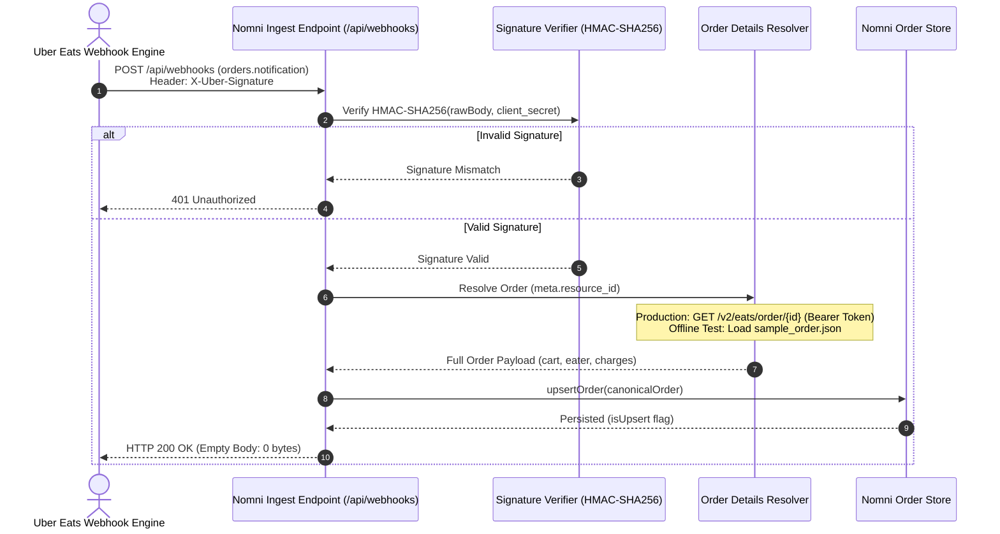
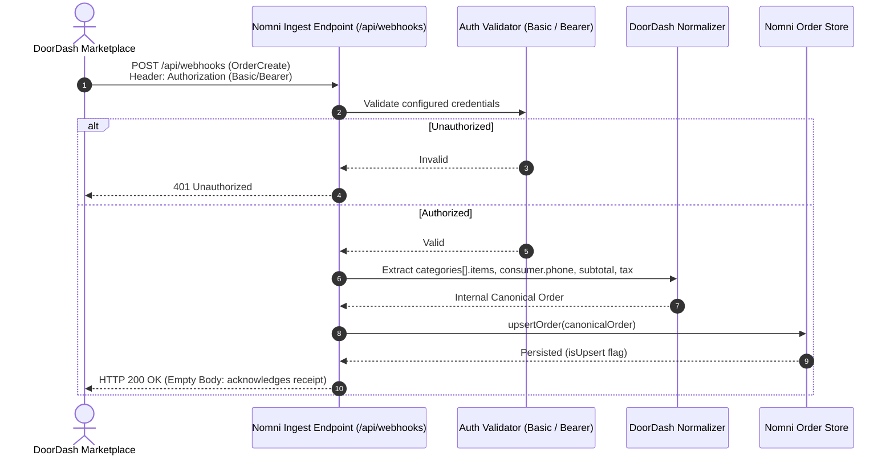
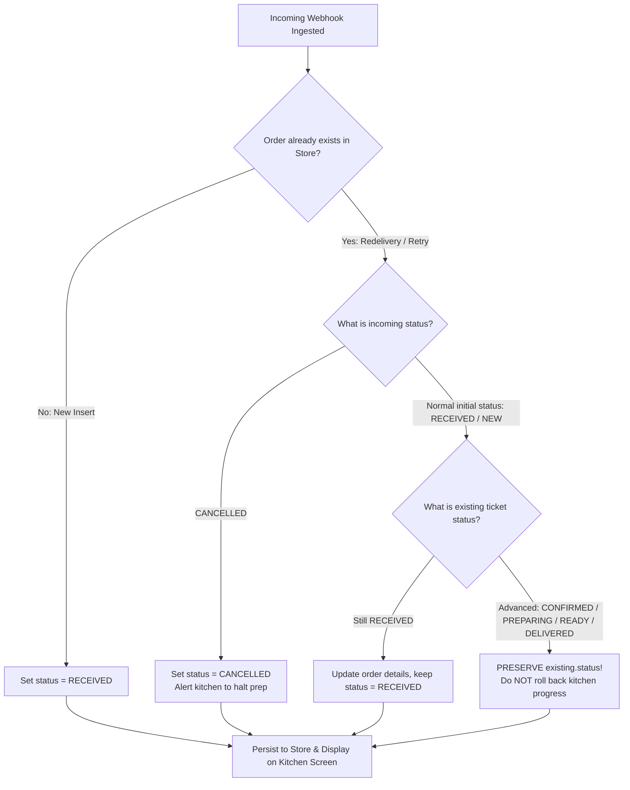

# Nomni — Revision Changes & Architectural Audit (CHANGES.md)

**Author:** Ayon Sarkar  
**Reviewer:** Anivar A Aravind (VP Engineering – Platform, Nomni)  
**Date:** October 8, 2026  

---

## 1. Conflicts Log

All 10 rows in the Conflicts Log were re-verified against official documentation from the **Uber Eats Developer Portal** and **DoorDash Developer Portal**. Each row cites the exact document title, section header, and direct canonical URL. Invariant decisions that are internal to Nomni (such as payload sniffing and internal status mapping) are explicitly labeled as **Internal Design Decisions**.

| # | Working Note in Brief | Verification Finding | Verdict | Authoritative Overruling Documentation |
| :--- | :--- | :--- | :--- | :--- |
| **1** | _Uber may include the full cart in the webhook; verify whether a Get Order call is still required._ | The `orders.notification` webhook delivers event metadata including `meta.resource_id` and `resource_href`; it does **not** contain the cart or line items. The full order, including cart data, must be retrieved using the referenced Get Order endpoint. | **REJECTED / CHANGED** | [Uber Eats `orders.notification` API](https://developer.uber.com/docs/eats/references/api/webhooks.orders-notification) — **“Webhook Event Structure”**, **“Example Webhook”**; [Uber Eats Get Order API v2](https://developer.uber.com/docs/eats/references/api/v2/get-eats-order-orderid) — **“Response Body - Order”** |
| **2** | _DoorDash Marketplace line items may use a top-level `items[]`._ | In the official DoorDash Marketplace Order schema, line items are nested under `order.categories[].items[]`. The webhook envelope contains the top-level `event` and `order` objects; there is no documented top-level `order.items[]` field. | **REJECTED / CHANGED** | [DoorDash Marketplace API Specification](https://developer.doordash.com/en-US/api/marketplace/#tag/Models/Order) — **“Order”** schema, specifically **`categories` → `items`**; [DoorDash Order Integration](https://developer.doordash.com/en-US/docs/marketplace/how_to/order_integration/) — **“Receiving Orders from DoorDash”** |
| **3** | _Verify which DoorDash monetary field should become `total_cents` and whether tax is included._ | DoorDash documents `subtotal` and `tax` as separate integer monetary fields. `tax` is therefore not represented as part of the documented `subtotal`. The Marketplace Order schema also documents `merchant_tip_amount` and `tip_amount`; `tip_amount` is specifically the delivery tip for Self Delivery orders. The current official schema does **not** document a `total_cents` or `total_discount_amount` field/formula. Therefore, the previous formula should not be represented as an official DoorDash calculation. | **VERIFIED & REFINED** | [DoorDash Marketplace API Specification](https://developer.doordash.com/en-US/api/marketplace/#tag/Models/Order) — **“Order”** schema, specifically **`subtotal`**, **`tax`**, **`merchant_tip_amount`**, and **`tip_amount`** fields |
| **4** | _Verify Uber webhook signature generation and the `X-Uber-Signature` header._ | Uber signs the raw webhook request body using HMAC-SHA256 with the application's `client_secret`. The resulting hexadecimal digest is supplied in the `X-Uber-Signature` header. | **VERIFIED AS CORRECT** | [Uber Eats Webhooks](https://developer.uber.com/docs/eats/guides/webhooks) — **“Webhook Security”** |
| **5** | _Verify the exact Uber webhook response status/body._ | The webhook receiver must acknowledge the notification with HTTP `200 OK` and an **empty response body**. Therefore, the previous wording should not describe the response body as `{}`; `{}` is a JSON object rather than an empty body. | **VERIFIED / WORDING CORRECTED** | [Uber Eats Webhooks](https://developer.uber.com/docs/eats/references/api/order_suite#tag/WebhookEvents/paths/webhookEvents/post) — **“Expected response”** |
| **6** | _DoorDash Drive webhooks are optional._ | DoorDash Drive is a separate white-label delivery/fulfillment API. The integration under review handles DoorDash **Marketplace** orders and its `OrderCreate`/order webhook flow. Drive webhooks are therefore **out of scope**, rather than an optional component of the Marketplace integration. | **VERIFIED AS OUT OF SCOPE** | [DoorDash Drive Webhooks](https://developer.doordash.com/en-US/docs/drive/how_to/webhooks/) — **“Webhooks”** |
| **7** | _Verify whether Uber webhook `meta.resource_id` corresponds to the Get Order ID in the official examples._ | `meta.resource_id` identifies the order resource. The corresponding `resource_href` uses that identifier as the order ID for the Get Order request, matching the `{order_id}` path parameter documented by the Get Order API. | **VERIFIED AS CORRECT** | [Uber Eats `orders.notification` API](https://developer.uber.com/docs/eats/references/api/webhooks.orders-notification) — **“Webhook Event Structure”**, **“Example Webhook”**; [Uber Eats Get Order API v2](https://developer.uber.com/docs/eats/references/api/v2/get-eats-order-orderid) — **“Path Parameters” → `order_id`** |
| **8** | _Do not rely on a provider query parameter for normal provider detection._ | The implementation detects the provider using structural characteristics of the incoming payload rather than a provider query parameter. This is an **internal system-design decision**, not a behavior mandated by either provider's documentation. | **VERIFIED AS INTERNAL DESIGN DECISION** | **No provider documentation — internal integration invariant.** Uber's documented payload structure: [Uber Eats `orders.notification` API](https://developer.uber.com/docs/eats/references/api/webhooks.orders-notification) — **“Webhook Event Structure”**. DoorDash's documented payload structure: [DoorDash Marketplace](https://developer.doordash.com/en-US/docs/marketplace/how_to/order_integration/#receiving-orders-from-doordash) |
| **9** | _Verify the documented location of DoorDash customer phone data._ | DoorDash places the customer phone number under `order.consumer.phone`. DoorDash also documents that this number may be masked depending on the integration/fulfillment configuration. | **VERIFIED AS CORRECT** | [DoorDash Marketplace API Specification](https://developer.doordash.com/en-US/api/marketplace/#tag/Models/Order) — **“Order” → `consumer` → `phone`**; [DoorDash Masked Customer Phone Number](https://developer.doordash.com/en-US/docs/marketplace/retail/orders/features/masked_number/) — **“Get Started” → “Step 2”** |
| **10** | _Normalize marketplace statuses into the internal status model where appropriate._ | Uber documents order states including `CREATED` and `ACCEPTED`. DoorDash Marketplace sends incoming orders with status `NEW`; order confirmation is performed separately using `order_status: "success"` or `"fail"`. Therefore, mapping Uber `CREATED` → internal `RECEIVED`, DoorDash `NEW` → internal `RECEIVED`, and a successful DoorDash confirmation → internal `CONFIRMED` is an **internal canonical-domain mapping**, not a mapping from a DoorDash provider status named `CONFIRMED`. | **VERIFIED PROVIDER STATES / INTERNAL MAPPING** | [Uber Eats Get Order API v2](https://developer.uber.com/docs/eats/references/api/v2/get-eats-order-orderid) — **“Response Body - Order” → `current_state`**; [DoorDash Receive Orders](https://developer.doordash.com/en-US/docs/marketplace/how_to/order_integration/) — **“Receiving Orders from DoorDash”**; [DoorDash Order Confirmation](https://developer.doordash.com/en-US/docs/marketplace/retail/orders/reference/order_confirm/) — **“Sample order confirmation”** |

---

## 2. Uber Flow

I verified the documented flow end-to-end, from notification to order retrieval, and confirmed it against the official fixtures:

1. **Notification Receipt:** Incoming `POST /api/webhooks` delivers an `orders.notification` event with `meta.resource_id` and `resource_href`.
2. **Signature Verification:** Uber signs the raw body using HMAC-SHA256 with the application's `client_secret`, delivered in the `X-Uber-Signature` header.
3. **Order Retrieval:** The `orders.notification` webhook does not contain cart data. `meta.resource_id` is used to fetch full order details via `GET /v2/eats/order/{order_id}` with Bearer OAuth token (or resolved from `fixtures/uber/sample_order.json` in offline mode).
4. **Ingestion & Monotonic Upsert:** The retrieved order is normalized into the internal canonical schema and persisted.
5. **Webhook Acknowledgment:** Returns HTTP `200 OK` with an **empty response body** (0 bytes) per official Uber Eats documentation.

---

## 3. Fixtures

### Official Fixtures Inventory
All fixtures are official sample payloads from the official documentation:

| Fixture File | Provider & API Source | Official Document Section |
| :--- | :--- | :--- |
| `fixtures/uber/sample_webhook.json` | Uber Eats `orders.notification` Webhook | [Uber Eats Webhooks](https://developer.uber.com/docs/eats/references/api/webhooks.orders-notification) — “Example Webhook” |
| `fixtures/uber/sample_order.json` | Uber Eats Get Order v2 Response | [Uber Eats Get Order v2](https://developer.uber.com/docs/eats/references/api/v2/get-eats-order-orderid) — “Response Body - Order” |
| `fixtures/doordash/sample.json` | DoorDash Marketplace `OrderCreate` Webhook | [DoorDash Order Integration](https://developer.doordash.com/en-US/docs/marketplace/how_to/order_integration/) — “Receiving Orders from DoorDash”; [DoorDash Sample Order Reference](https://developer.doordash.com/en-US/docs/marketplace/reference/sample_order) |

### Surprises Identified in the Official Examples
1. **Uber Documentation ID Discrepancy:** The `orders.notification` documentation sample uses `"meta": { "resource_id": "153dd7f1-339d-4619-940c-418943c14636" }`, whereas the Get Order documentation sample uses `"id": "f9f363d1-e1c2-4595-b477-c649845bc953"`. In `fixtures/uber/sample_order.json`, I aligned the `id` to `"153dd7f1-339d-4619-940c-418943c14636"` so the two official fixtures link together end-to-end.
2. **Uber Webhook Contains No Cart Data:** The `orders.notification` payload delivers only event metadata (11 lines of JSON). It contains zero line items or customer data, requiring an authenticated Get Order API call to retrieve the order cart.
3. **DoorDash Line Items Under Categories:** Items are nested under `order.categories[].items[]` rather than a top-level `order.items[]`.
4. **DoorDash Monetary Fields:** Subtotal, tax, and tips are provided in integer cents, but the payload does not contain a precalculated `total_cents` field.
5. **DoorDash Masked Phone Numbers:** In `sample.json`, the customer phone is `+18559731040` (a DoorDash toll-free relay number).

---

## 4. DoorDash

I verified authentication and webhook response requirements against the official documentation:

1. **Webhook Authentication:** DoorDash Marketplace does not use an HMAC signature header. Authentication is configured by the developer in the Developer Portal (supporting Basic Auth and OAuth Bearer tokens). My implementation (`verifyDoorDashAuth()`) supports both `Authorization: Bearer <TOKEN>` and `Authorization: Basic <TOKEN>`.
2. **Webhook Acknowledgment Response:**
   - **Documented requirement:** Under **“Synchronous Order Confirmation”** ([DoorDash Order Integration](https://developer.doordash.com/en-US/docs/marketplace/how_to/order_integration/#synchronous-order-confirmation)), DoorDash states: *“Return 200 for an order success, a non 2xx will be treated as an order failure.”*
   - **What is unknown:** The public Marketplace documentation does not specify any response body schema for webhook acknowledgments.
   - **Implementation:** My endpoint returns HTTP `200 OK` with an **empty response body** (`new NextResponse(null, { status: 200 })`), acknowledging receipt without inventing ungrounded response schemas.

---

## 5. Redelivery

### What the Kitchen Sees on Duplicate Webhook Delivery
When the same webhook arrives again after kitchen staff have moved an order forward (`CONFIRMED`, `PREPARING`, `READY`, `DELIVERED`):
- **Kitchen view is preserved:** The ticket does **not** roll back to `RECEIVED` on the kitchen display. Active cooking and fulfillment progress are preserved (`existing.status`).
- **Idempotent ingestion:** Order details are updated without regressing the lifecycle state.
- **Cancellation handling:** Only an explicit cancellation (`CANCELLED`) transitions an active order, alerting staff to halt preparation.

I implemented this monotonic lifecycle guard in `src/lib/store.ts`:
- If an existing order is already past `RECEIVED`, incoming initial-status retries preserve the current `existing.status`.
- Untouched orders (`RECEIVED`) adopt incoming updates.
- Cancellations (`CANCELLED`) take immediate effect.

