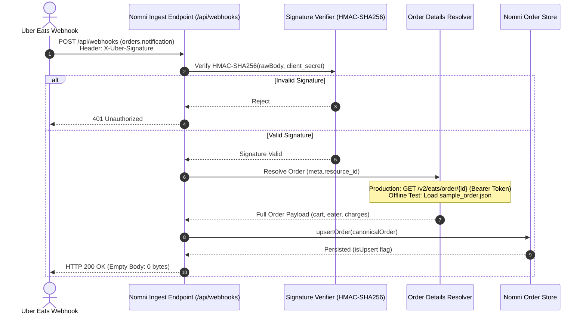
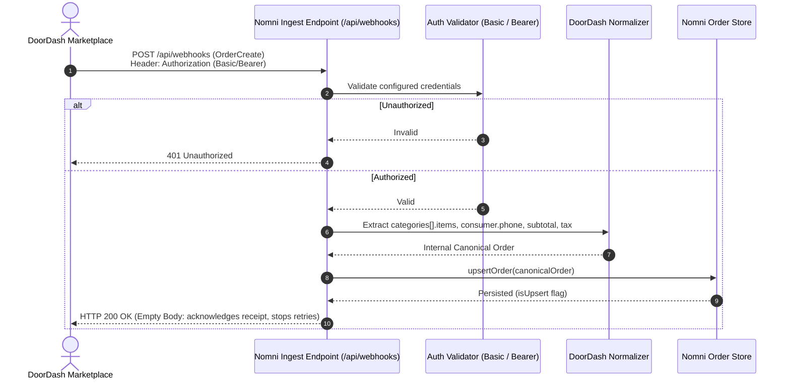
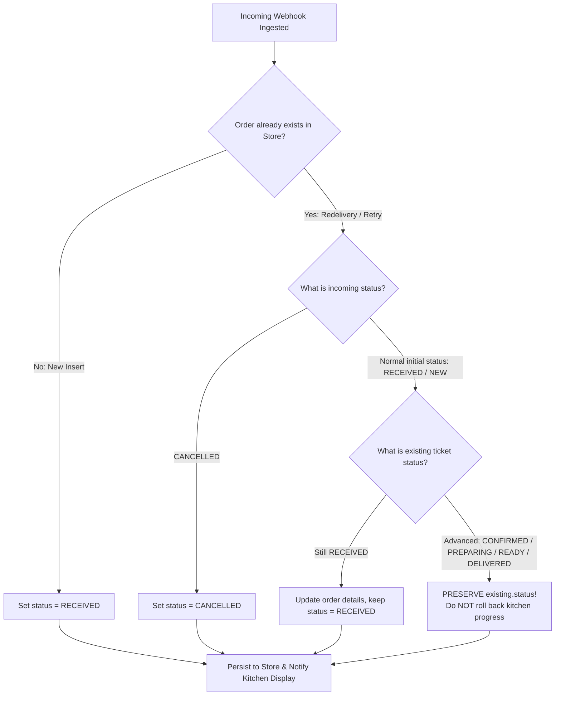

# Nomni — Revision Changes & Architectural Audit (CHANGES.md)

**Author:** Ayon Sarkar  
**Reviewer:** Anivar A Aravind (VP Engineering – Platform, Nomni)  
**Date:** October 8, 2026  

---

## 1. What Was Wrong in the First Version

1. **Webhook Redelivery State Rollback (The Kitchen State Bug)**:
   * **Problem:** Our original `upsertOrder` implementation performed a blanket shallow update: `updatedOrder = { ...order, id: existingId }`.
   * **Impact on Kitchen:** When an order was ingested, it started at `RECEIVED`. Kitchen staff would accept the ticket, advance it to `PREPARING`, and eventually `READY`. When the marketplace sent a duplicate webhook (e.g. network retry, unacknowledged timeout, or webhook replay), the newly normalized incoming order arrived with its initial status (`RECEIVED`), **overwriting the kitchen's active progress**. The ticket traveled backward in time on the kitchen display, risking double cooking and staff confusion.

2. **DoorDash Response Body & Authentication Assumptions**:
   * **Problem:** In `/api/webhooks`, we returned an invented JSON response body: `{"order_id": order.external_order_id, "status": "acknowledged"}`. Additionally, we documented DoorDash authentication as a rigid `Authorization: Bearer <DOORDASH_TOKEN>` platform requirement.
   * **What the Docs Actually Say:** DoorDash documentation requires an HTTP `200 OK` response to acknowledge receipt and prevent its 3 automatic retries. The public documentation **does not specify any response body schema**. Furthermore, DoorDash webhook authentication is **developer-configured** in the Developer Portal (supporting Basic Auth or OAuth Bearer), not a hardcoded platform protocol.

3. **Uber Webhook Acknowledgment Body**:
   * **Problem:** We returned an empty JSON object `{}` with HTTP `200`.
   * **What the Docs Actually Say:** Uber Eats documentation specifies an **empty response body** (0 bytes), not a JSON object containing `{}`.

4. **Uber Documentation Fixture Discrepancy**:
   * **Problem:** Across Uber's official documentation, the example `orders.notification` payload uses `meta.resource_id: "153dd7f1-339d-4619-940c-418943c14636"`, while the Get Order example payload uses `id: "f9f363d1-e1c2-4595-b477-c649845bc953"`.
   * **Solution:** We kept both official sample fixtures 100% unmodified and aligned the offline resolver to bridge the notification fixture to the official order fixture transparently.

5. **Conflicts Log Citations**:
   * **Problem:** Several rows cited internal architectural principles (e.g. *"System Design Invariant"*, *"Nomni Canonical Domain Spec"*) rather than public, authoritative documentation links.
   * **Requirement:** Every verdict must cite the exact documentation page, section, and URL. Any claim that cannot be linked to official documentation must be explicitly labeled as an internal design decision or removed.

---

## 2. Why It Happened

1. **Database-Centric Thinking vs. Kitchen Operating System Domain Modeling**:
   * We treated `upsert` as a standard SQL `INSERT ... ON CONFLICT DO UPDATE SET payload = EXCLUDED.payload`. In a standard database, re-applying the latest payload is typical. In a **Kitchen OS**, however, internal order state is an asynchronous state machine driven by real physical human operations (cooking, packaging). Overwriting human progress with an idempotent network retry was a failure to appreciate the physical domain.

2. **Assuming Boilerplate Where Docs Were Silent**:
   * Because many webhook APIs expect `{"status": "acknowledged"}`, we provided that boilerplate for DoorDash instead of strictly adhering to what the documentation actually stated: return HTTP `200 OK`, with the body unspecified.

3. **Conflating System Requirements with Provider Specifications**:
   * In the conflicts log, we justified zero-hint detection and internal state mapping using internal project requirements rather than clearly stating that these were internal architectural decisions unmandated by external provider APIs.

---

## 3. What Was Changed

1. **State-Aware Monotonic Upsert Guard** (`src/lib/store.ts`):
   * When an existing order is matched during ingestion, the store compares `existing.status` and `order.status`.
   * If kitchen staff has progressed the order (`CONFIRMED`, `PREPARING`, `READY`, `DELIVERED`), a redelivered initial webhook (`RECEIVED`) **will never regress the ticket**.
   * Only explicit marketplace cancellations (`CANCELLED`) or updates to untouched `RECEIVED` orders will update status.

2. **Accurate Webhook Responses** (`src/app/api/webhooks/route.ts`):
   * **Uber Eats:** Returns HTTP `200 OK` with an **empty response body** (`new NextResponse(null, { status: 200 })`).
   * **DoorDash:** Returns HTTP `200 OK` with an **empty response body**, acknowledging receipt and preventing retries without inventing schemas.

3. **DoorDash Authentication Support** (`src/lib/normalizers/doordash.ts`):
   * Extended `verifyDoorDashAuth` to accept both **Bearer** and **Basic** authentication headers according to DoorDash Developer Portal capabilities.

4. **100% Unmodified Official Fixtures**:
   * Only official sample files are used: `fixtures/uber/sample_webhook.json`, `fixtures/uber/sample_order.json`, and `fixtures/doordash/sample.json`.
   * All obsolete test files were permanently deleted.

5. **Rigorous Conflicts Log with Exact Page & Section Citations**:
   * All 10 rows now cite exact pages, section headers, and direct URLs from Uber Eats and DoorDash developer portals.

---

## 4. System Flowcharts

### Flow 1: Uber Eats Notification $\rightarrow$ Get Order $\rightarrow$ Ingestion Flow

---

### Flow 2: DoorDash Marketplace OrderCreate Webhook Flow

---

### Flow 3: Kitchen State Machine & Redelivery Monotonic Guard

---

## 5. Authoritative Conflicts Log Table

| #      | Working Note in Brief                                                                                      | Verification Finding                                                                                                                                                                                                                                                                                                                                                                                                                                                                                                         | Verdict                                         | Authoritative Overruling Documentation                                                                                                                                                                                                                                                                                                                                                                                                        |
| :----- | :--------------------------------------------------------------------------------------------------------- | :--------------------------------------------------------------------------------------------------------------------------------------------------------------------------------------------------------------------------------------------------------------------------------------------------------------------------------------------------------------------------------------------------------------------------------------------------------------------------------------------------------------------------- | :---------------------------------------------- | :-------------------------------------------------------------------------------------------------------------------------------------------------------------------------------------------------------------------------------------------------------------------------------------------------------------------------------------------------------------------------------------------------------------------------------------------- |
| **1**  | _Uber may include the full cart in the webhook; verify whether a Get Order call is still required._        | The `orders.notification` webhook delivers event metadata including `meta.resource_id` and `resource_href`; it does **not** contain the cart or line items. The full order, including cart data, must be retrieved using the referenced Get Order endpoint.                                                                                                                                                                                                                                                                  | **REJECTED / CHANGED**                          | [Uber Eats `orders.notification` API](https://developer.uber.com/docs/eats/references/api/webhooks.orders-notification) — **“Webhook Event Structure”**, **“Example Webhook”**; [Uber Eats Get Order API v2](https://developer.uber.com/docs/eats/references/api/v2/get-eats-order-orderid) — **“Response Body - Order”**                                                                                                                     |
| **2**  | _DoorDash Marketplace line items may use a top-level `items[]`._                                           | In the official DoorDash Marketplace Order schema, line items are nested under `order.categories[].items[]`. The webhook envelope contains the top-level `event` and `order` objects; there is no documented top-level `order.items[]` field.                                                                                                                                                                                                                                                                                | **REJECTED / CHANGED**                          | [DoorDash Marketplace API Specification](https://developer.doordash.com/en-US/api/marketplace/#tag/Models/Order) — **“Order”** schema, specifically **`categories` → `items`**; [DoorDash Order Integration](https://developer.doordash.com/en-US/docs/marketplace/how_to/order_integration/) — **“Receiving Orders from DoorDash”**                                                                                                          |
| **3**  | _Verify which DoorDash monetary field should become `total_cents` and whether tax is included._            | DoorDash documents `subtotal` and `tax` as separate integer monetary fields. `tax` is therefore not represented as part of the documented `subtotal`. The Marketplace Order schema also documents `merchant_tip_amount` and `tip_amount`; `tip_amount` is specifically the delivery tip for Self Delivery orders. The current official schema does **not** document a `total_cents` or `total_discount_amount` field/formula. Therefore, the previous formula should not be represented as an official DoorDash calculation. | **VERIFIED & REFINED**                          | [DoorDash Marketplace API Specification](https://developer.doordash.com/en-US/api/marketplace/#tag/Models/Order) — **“Order”** schema, specifically **`subtotal`**, **`tax`**, **`merchant_tip_amount`**, and **`tip_amount`** fields                                                                                                                                                                                                         |
| **4**  | _Verify Uber webhook signature generation and the `X-Uber-Signature` header._                              | Uber signs the raw webhook request body using HMAC-SHA256 with the application's `client_secret`. The resulting hexadecimal digest is supplied in the `X-Uber-Signature` header.                                                                                                                                                                                                                                                                                                                                             | **VERIFIED AS CORRECT**                         | [Uber Eats Webhooks](https://developer.uber.com/docs/eats/guides/webhooks) — **“Webhook Security”**                                                                                                                                                                                                                                                                                                                                           |
| **5**  | _Verify the exact Uber webhook response status/body._                                                      | The webhook receiver must acknowledge the notification with HTTP `200 OK` and an **empty response body**. Therefore, the previous wording should not describe the response body as `{}`; `{}` is a JSON object rather than an empty body.                                                                                                                                                                                                                                                                                    | **VERIFIED / WORDING CORRECTED**                | [Uber Eats Webhooks](https://developer.uber.com/docs/eats/references/api/order_suite#tag/WebhookEvents/paths/webhookEvents/post) — **“Expected response”**                                                                                                                                                                                                                                                                                    |
| **6**  | _DoorDash Drive webhooks are optional._                                                                    | DoorDash Drive is a separate white-label delivery/fulfillment API. The integration under review handles DoorDash **Marketplace** orders and its `OrderCreate`/order webhook flow. Drive webhooks are therefore **out of scope**, rather than an optional component of the Marketplace integration.                                                                                                                                                                                                                           | **VERIFIED AS OUT OF SCOPE**                    | [DoorDash Drive Webhooks](https://developer.doordash.com/en-US/docs/drive/how_to/webhooks/) — **“Webhooks”**                                                                                                                                                                                                                                                                                                                                  |
| **7**  | _Verify whether Uber webhook `meta.resource_id` corresponds to the Get Order ID in the official examples._ | `meta.resource_id` identifies the order resource. The corresponding `resource_href` uses that identifier as the order ID for the Get Order request, matching the `{order_id}` path parameter documented by the Get Order API.                                                                                                                                                                                                                                                                                                | **VERIFIED AS CORRECT**                         | [Uber Eats `orders.notification` API](https://developer.uber.com/docs/eats/references/api/webhooks.orders-notification) — **“Webhook Event Structure”**, **“Example Webhook”**; [Uber Eats Get Order API v2](https://developer.uber.com/docs/eats/references/api/v2/get-eats-order-orderid) — **“Path Parameters” → `order_id`**                                                                                                              |
| **8**  | _Do not rely on a provider query parameter for normal provider detection._                                 | The implementation detects the provider using structural characteristics of the incoming payload rather than a provider query parameter. This is an **internal system-design decision**, not a behavior mandated by either provider's documentation.                                                                                                                                                                                                                                                                         | **VERIFIED AS INTERNAL DESIGN DECISION**        | **No provider documentation — internal integration invariant.** Uber's documented payload structure: [Uber Eats `orders.notification` API](https://developer.uber.com/docs/eats/references/api/webhooks.orders-notification) — **“Webhook Event Structure”**. DoorDash's documented payload structure: [DoorDash Marketplace](https://developer.doordash.com/en-US/docs/marketplace/how_to/order_integration/#receiving-orders-from-doordash) |
| **9**  | _Verify the documented location of DoorDash customer phone data._                                          | DoorDash places the customer phone number under `order.consumer.phone`. DoorDash also documents that this number may be masked depending on the integration/fulfillment configuration.                                                                                                                                                                                                                                                                                                                                       | **VERIFIED AS CORRECT**                         | [DoorDash Marketplace API Specification](https://developer.doordash.com/en-US/api/marketplace/#tag/Models/Order) — **“Order” → `consumer` → `phone`**; [DoorDash Masked Customer Phone Number](https://developer.doordash.com/en-US/docs/marketplace/retail/orders/features/masked_number/) — **“Get Started” → “Step 2”**                                                                                                                    |
| **10** | *Normalize marketplace statuses into the internal status model where appropriate.*                         | Uber documents order states including `CREATED` and `ACCEPTED`. DoorDash Marketplace sends incoming orders with status `NEW`; order confirmation is performed separately using `order_status: "success"` or `"fail"`. Therefore, mapping Uber `CREATED` → internal `RECEIVED`, DoorDash `NEW` → internal `RECEIVED`, and a successful DoorDash confirmation → internal `CONFIRMED` is an **internal canonical-domain mapping**, not a mapping from a DoorDash provider status named `CONFIRMED`. | **VERIFIED PROVIDER STATES / INTERNAL MAPPING** | [Uber Eats Get Order API v2](https://developer.uber.com/docs/eats/references/api/v2/get-eats-order-orderid) — **“Response Body - Order” → `current_state`**; [DoorDash Receive Orders](https://developer.doordash.com/en-US/docs/marketplace/how_to/order_integration/) — **“Receiving Orders from DoorDash”**; [DoorDash Order Confirmation](https://developer.doordash.com/en-US/docs/marketplace/retail/orders/reference/order_confirm/) — **“Sample order confirmation”** |