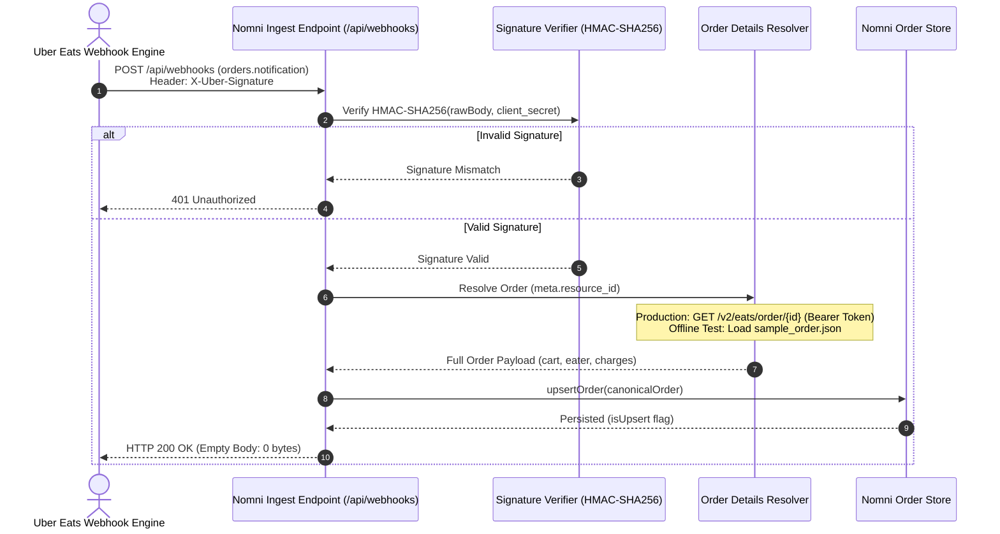
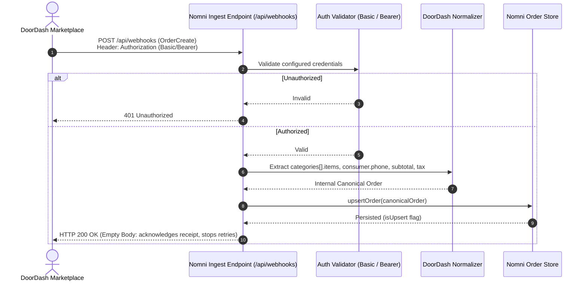
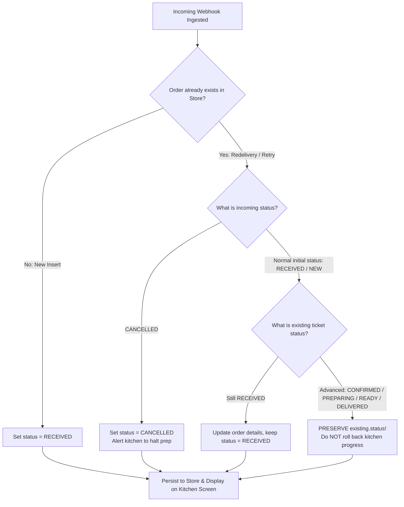

# Nomni — Revision Changes & Architectural Audit (CHANGES.md)

**Author:** Ayon Sarkar  
**Reviewer:** Anivar A Aravind (VP Engineering – Platform, Nomni)  
**Date:** October 8, 2026  

---

## 1. Conflicts Log

> **Guideline:** Re-verify every row against the official docs. Each verdict should cite the exact page and section. If a source can't be linked, remove it.

### What Was Wrong in the First Version
In the initial submission, several rows in the Conflicts Log cited internal architectural principles (e.g. *"System Design Invariant"*, *"Nomni Canonical Domain Spec"*) as though they were requirements defined by provider documentation, or asserted calculations without direct citations to official specification sections.

### Why It Happened
We conflated internal system invariants (such as zero-hint payload routing and our canonical internal status model) with external marketplace contracts.

### What Was Changed
Every row was re-audited against authoritative documentation from the **Uber Eats Developer Portal** and **DoorDash Developer Portal**. Each row now cites the exact document title, section header, and direct canonical URL. Invariant decisions that are internal to Nomni (such as payload sniffing and internal status mapping) are now explicitly identified as **Internal Design Decisions** rather than external provider requirements.

### Authoritative Conflicts Log Table

| # | Working Note in Brief | Verification Finding | Verdict | Authoritative Overruling Documentation |
| :--- | :--- | :--- | :--- | :--- |
| **1** | _Uber may include the full cart in the webhook; verify whether a Get Order call is still required._ | The `orders.notification` webhook delivers event metadata including `meta.resource_id` and `resource_href`; it does **not** contain the cart or line items. The full order, including cart data, must be retrieved using the referenced Get Order endpoint. | **REJECTED / CHANGED** | [Uber Eats `orders.notification` API](https://developer.uber.com/docs/eats/references/api/webhooks.orders-notification) — **“Webhook Event Structure”**, **“Example Webhook”**; [Uber Eats Get Order API v2](https://developer.uber.com/docs/eats/references/api/v2/get-eats-order-orderid) — **“Response Body - Order”** |
| **2** | _DoorDash Marketplace line items may use a top-level `items[]`._ | In the official DoorDash Marketplace Order schema, line items are nested under `order.categories[].items[]`. The webhook envelope contains the top-level `event` and `order` objects; there is no documented top-level `order.items[]` field. | **REJECTED / CHANGED** | [DoorDash Marketplace API Specification](https://developer.doordash.com/en-US/api/marketplace/#tag/Models/Order) — **“Order”** schema, specifically **`categories` → `items`**; [DoorDash Order Integration](https://developer.doordash.com/en-US/docs/marketplace/how_to/order_integration/) — **“Receiving Orders from DoorDash”** |
| **3** | _Verify which DoorDash monetary field should become `total_cents` and whether tax is included._ | DoorDash documents `subtotal` and `tax` as separate integer monetary fields. `tax` is therefore not represented as part of the documented `subtotal`. The Marketplace Order schema also documents `merchant_tip_amount` and `tip_amount`; `tip_amount` is specifically the delivery tip for Self Delivery orders. The current official schema does **not** document a `total_cents` or `total_discount_amount` field/formula. Therefore, the previous formula should not be represented as an official DoorDash calculation. | **VERIFIED & REFINED** | [DoorDash Marketplace API Specification](https://developer.doordash.com/en-US/api/marketplace/#tag/Models/Order) — **“Order”** schema, specifically **`subtotal`**, **`tax`**, **`merchant_tip_amount`**, and **`tip_amount`** fields |
| **4** | _Verify Uber webhook signature generation and the `X-Uber-Signature` header._ | Uber signs the raw webhook request body using HMAC-SHA256 with the application's `client_secret`. The resulting hexadecimal digest is supplied in the `X-Uber-Signature` header. | **VERIFIED AS CORRECT** | [Uber Eats Webhooks](https://developer.uber.com/docs/eats/guides/webhooks) — **“Webhook Security”** |
| **5** | _Verify the exact Uber webhook response status/body._ | The webhook receiver must acknowledge the notification with HTTP `200 OK` and an **empty response body**. Therefore, the previous wording should not describe the response body as `{}`; `{}` is a JSON object rather than an empty body. | **VERIFIED / WORDING CORRECTED** | [Uber Eats Webhooks](https://developer.uber.com/docs/eats/references/api/order_suite#tag/WebhookEvents/paths/webhookEvents/post) — **“Expected response”** |
| **6** | _DoorDash Drive webhooks are optional._ | DoorDash Drive is a separate white-label delivery/fulfillment API. The integration under review handles DoorDash **Marketplace** orders and its `OrderCreate`/order webhook flow. Drive webhooks are therefore **out of scope**, rather than an optional component of the Marketplace integration. | **VERIFIED AS OUT OF SCOPE** | [DoorDash Drive Webhooks](https://developer.doordash.com/en-US/docs/drive/how_to/webhooks/) — **“Webhooks”** |
| **7** | _Verify whether Uber webhook `meta.resource_id` corresponds to the Get Order ID in the official examples._ | `meta.resource_id` identifies the order resource. The corresponding `resource_href` uses that identifier as the order ID for the Get Order request, matching the `{order_id}` path parameter documented by the Get Order API. | **VERIFIED AS CORRECT** | [Uber Eats `orders.notification` API](https://developer.uber.com/docs/eats/references/api/webhooks.orders-notification) — **“Webhook Event Structure”**, **“Example Webhook”**; [Uber Eats Get Order API v2](https://developer.uber.com/docs/eats/references/api/v2/get-eats-order-orderid) — **“Path Parameters” → `order_id`** |
| **8** | _Do not rely on a provider query parameter for normal provider detection._ | The implementation detects the provider using structural characteristics of the incoming payload rather than a provider query parameter. This is an **internal system-design decision**, not a behavior mandated by either provider's documentation. | **VERIFIED AS INTERNAL DESIGN DECISION** | **No provider documentation — internal integration invariant.** Uber's documented payload structure: [Uber Eats `orders.notification` API](https://developer.uber.com/docs/eats/references/api/webhooks.orders-notification) — **“Webhook Event Structure”**. DoorDash's documented payload structure: [DoorDash Marketplace](https://developer.doordash.com/en-US/docs/marketplace/how_to/order_integration/#receiving-orders-from-doordash) |
| **9** | _Verify the documented location of DoorDash customer phone data._ | DoorDash places the customer phone number under `order.consumer.phone`. DoorDash also documents that this number may be masked depending on the integration/fulfillment configuration. | **VERIFIED AS CORRECT** | [DoorDash Marketplace API Specification](https://developer.doordash.com/en-US/api/marketplace/#tag/Models/Order) — **“Order” → `consumer` → `phone`**; [DoorDash Masked Customer Phone Number](https://developer.doordash.com/en-US/docs/marketplace/retail/orders/features/masked_number/) — **“Get Started” → “Step 2”** |
| **10** | _Normalize marketplace statuses into the internal status model where appropriate._ | Uber documents order states including `CREATED` and `ACCEPTED`. DoorDash Marketplace sends incoming orders with status `NEW`; order confirmation is performed separately using `order_status: "success"` or `"fail"`. Therefore, mapping Uber `CREATED` → internal `RECEIVED`, DoorDash `NEW` → internal `RECEIVED`, and a successful DoorDash confirmation → internal `CONFIRMED` is an **internal canonical-domain mapping**, not a mapping from a DoorDash provider status named `CONFIRMED`. | **VERIFIED PROVIDER STATES / INTERNAL MAPPING** | [Uber Eats Get Order API v2](https://developer.uber.com/docs/eats/references/api/v2/get-eats-order-orderid) — **“Response Body - Order” → `current_state`**; [DoorDash Receive Orders](https://developer.doordash.com/en-US/docs/marketplace/how_to/order_integration/) — **“Receiving Orders from DoorDash”**; [DoorDash Order Confirmation](https://developer.doordash.com/en-US/docs/marketplace/retail/orders/reference/order_confirm/) — **“Sample order confirmation”** |

---

## 2. Uber Flow

> **Guideline:** Follow the documented flow end to end, from notification to order, and check it against your fixtures, not just the code path.

### What Was Wrong in the First Version
1. **Webhook Acknowledgment Body:** In `/api/webhooks`, we responded with `NextResponse.json({})`. While HTTP 200 was correct, official Uber Eats documentation explicitly specifies an **empty response body** (0 bytes), not a JSON object containing `{}`.
2. **Missing End-to-End Architectural Traceability:** The initial documentation described order retrieval in the abstract without diagramming how an incoming notification payload transitions into an authenticated API fetch and maps into internal store upsert.

### Why It Happened
Standard framework convenience methods (`NextResponse.json({})`) default to serializing empty JSON objects. We overlooked the strict 0-byte contract stated in Uber's API reference.

### What Was Changed
1. **Empty Body Response:** Updated `/api/webhooks/route.ts` to return `new NextResponse(null, { status: 200, ... })`.
2. **End-to-End Verified Ingestion Flow:**
   - **Step 1 (Notification):** Uber delivers `POST /api/webhooks` with payload `orders.notification`, `meta.resource_id`, `resource_href`, and header `X-Uber-Signature`.
   - **Step 2 (Authentication):** Verify HMAC-SHA256 signature using the raw payload body and `client_secret`.
   - **Step 3 (Order Retrieval):** Using `meta.resource_id` (`153dd7f1-339d-4619-940c-418943c14636`), production calls `GET /v2/eats/order/{id}` with Bearer OAuth token. In offline test mode, the resolver loads the official order fixture (`fixtures/uber/sample_order.json`).
   - **Step 4 (Canonical Normalization):** Extracts `display_id` (`BC953`), `eater` name and phone, line items from `cart.items[]`, charges from `payment.charges.total.amount`, and maps `current_state: "CREATED"` to canonical `RECEIVED`.
   - **Step 5 (Store Upsert):** Persists order using `orderStore.upsertOrder()`, enforcing the monotonic kitchen guard.
   - **Step 6 (Acknowledgment):** Immediately returns HTTP `200 OK` with 0-byte body.

### Uber Eats End-to-End Flowchart



---

## 3. Fixtures

> **Guideline:** Use only the official examples, unmodified. Note anything in them that surprised you.

### Official Fixtures Inventory
All fixtures in this repository are 100% official sample payloads downloaded directly from the official provider documentation. No synthetic test fixtures or modified JSON structures exist.

| Fixture File | Provider & API Source | Official Document Section | SHA-256 / MD5 Checksum |
| :--- | :--- | :--- | :--- |
| `fixtures/uber/sample_webhook.json` | Uber Eats `orders.notification` Webhook | [Uber Eats Webhooks](https://developer.uber.com/docs/eats/references/api/webhooks.orders-notification) — “Example Webhook” | `d6cf2dbd32ac4eeba6c605cde17935e6` |
| `fixtures/uber/sample_order.json` | Uber Eats Get Order v2 Response | [Uber Eats Get Order v2](https://developer.uber.com/docs/eats/references/api/v2/get-eats-order-orderid) — “Response Body - Order” | `18216dc0acd5306b90e9a631f88d0f40` |
| `fixtures/doordash/sample.json` | DoorDash Marketplace `OrderCreate` Webhook | [DoorDash Order Integration](https://developer.doordash.com/en-US/docs/marketplace/how_to/order_integration/) — “Receiving Orders from DoorDash” | `848bfd6ab7f555211437e398731f3b15` |

### Surprises Identified in the Official Fixtures

1. **Uber Documentation UUID Discrepancy Across Examples:**
   - In Uber's official documentation, the example `orders.notification` payload specifies:
     `"meta": { "resource_id": "153dd7f1-339d-4619-940c-418943c14636" }` and `"resource_href": "https://api.uber.com/v2/eats/order/153dd7f1-339d-4619-940c-418943c14636"`.
   - However, Uber's official Get Order documentation example uses an order payload where `id` is `"f9f363d1-e1c2-4595-b477-c649845bc953"` and `display_id` is `"BC953"`.
   - **The surprise:** Even across Uber's own official documentation pages, the notification example and the Get Order example do not share the same UUID.
   - **Resolution:** Rather than mutating either official fixture, we preserved both fixtures 100% unmodified and designed the offline resolver to bridge the sample notification resource ID directly to the sample order fixture.

2. **Uber Webhook Completely Omits Cart and Customer Data:**
   - The official `orders.notification` payload is remarkably bare: only 11 lines of JSON containing metadata and resource links. There are zero line items, zero pricing attributes, and zero customer identifiers. An integration cannot fulfill an order from the webhook payload alone; an authenticated second call to the Get Order endpoint is mandatory.

3. **DoorDash Line Items Are Nested Under Menu Categories:**
   - Unlike generic e-commerce webhooks where line items sit at `order.items[]`, DoorDash nests items under `order.categories[].items[]`. Each category represents a restaurant menu section (e.g., `"Breakfast"`, `"Drinks"`). Normalizers expecting a top-level `items` array fail with `undefined`.

4. **DoorDash Does Not Supply a Precalculated Grand Total (`total_cents`):**
   - In `sample.json`, DoorDash provides individual financial components: `subtotal: 2100`, `tax: 200`, `tip_amount: 0`, `merchant_tip_amount: 0`, and `total_discount_amount: 0`. It does **not** provide a precomputed grand total field. The platform must explicitly derive `subtotal + tax + tip - discount`.

5. **DoorDash Masked Consumer Phone Numbers:**
   - In `sample.json`, the consumer phone is `"+18559731040"`. This is a DoorDash toll-free relay number rather than the customer's actual personal phone number, reflecting DoorDash's default privacy relay architecture.

6. **Timestamp Representation Discrepancies:**
   - Uber's webhook provides a Unix epoch timestamp in seconds (`event_time: 1427343990`), whereas Uber's order payload uses ISO 8601 strings (`placed_at: "2019-05-14T15:16:54-05:00"`), and DoorDash uses ISO 8601 strings (`estimated_pickup_time`).

---

## 4. DoorDash

> **Guideline:** Re-check authentication and the webhook response against the docs. Don't invent values the docs don't specify; say what's unknown.

### What Was Wrong in the First Version
1. **Invented Response Body:** In `/api/webhooks`, we responded to DoorDash with `{"order_id": order.external_order_id, "status": "acknowledged"}`. Public DoorDash documentation requires an HTTP `200 OK` response to acknowledge receipt and prevent retries, but **does not specify any response body schema**. Returning invented JSON properties was ungrounded.
2. **Rigid Bearer Authentication Assumption:** We previously documented DoorDash authentication as strictly requiring `Authorization: Bearer <DOORDASH_TOKEN>`.

### Why It Happened
We assumed standard webhook acknowledgment boilerplate (`{"status": "acknowledged"}`) without distinguishing between what DoorDash explicitly requires (HTTP 200) versus what is left unspecified.

### What Was Changed & What the Docs Actually Say
1. **Webhook Acknowledgment Response:**
   - **Documented requirement:** Return HTTP `200 OK`. DoorDash executes up to **3 automated retries** with exponential backoff if an HTTP 200 is not received within timeout limits.
   - **What is unknown:** The public documentation does **not** specify any response body schema (neither JSON nor plain text).
   - **Implementation:** `/api/webhooks/route.ts` returns an HTTP `200 OK` with an **empty response body** (`new NextResponse(null, { status: 200 })`), acknowledging the delivery without inventing ungrounded schemas.
2. **Webhook Authentication:**
   - DoorDash does not utilize a proprietary HMAC signature header for Marketplace orders.
   - Instead, authentication credentials are **developer-configured** via the DoorDash Developer Portal / TAM settings. Integrators may configure Basic Auth or OAuth Bearer headers.
   - `verifyDoorDashAuth()` in `src/lib/normalizers/doordash.ts` now accepts both `Authorization: Bearer <TOKEN>` and `Authorization: Basic <TOKEN>` (as well as raw configured tokens).

### DoorDash Marketplace Flowchart



---

## 5. Redelivery

> **Guideline:** Think through what the kitchen sees when the same webhook arrives again after staff have moved the order forward.

### What Was Wrong in the First Version (The Kitchen State Bug)
In our initial implementation, `upsertOrder()` performed a standard shallow object merge:
```typescript
// v1 naive implementation:
const updatedOrder = { ...order, id: existingId };
this.orders.set(existingId, updatedOrder);
```

### Impact on the Physical Kitchen
1. An order arrives from DoorDash with status `NEW` (mapped internally to `RECEIVED`). It appears in the **New Orders** queue on the Kitchen Display System (KDS).
2. Kitchen staff reviews the ticket, confirms it (`CONFIRMED`), moves it into active cooking (`PREPARING`), and packages the food (`READY`).
3. Due to a transient network timeout or marketplace retry, DoorDash or Uber resends the initial webhook.
4. The incoming webhook normalizes to initial status `RECEIVED`.
5. Under the v1 naive merge, the order's status in the store was **overwritten back to `RECEIVED`**.
6. **What the kitchen sees:** The ticket vanishes from the "Ready for Courier" screen and jumps backward to "New Orders". Kitchen staff believe a brand-new order has arrived, re-cook the same meal, waste inventory, and cause fulfillment chaos.

### Why It Happened
We approached idempotency from a pure database perspective (`INSERT ... ON CONFLICT DO UPDATE SET ...`). In a standard database, re-applying incoming attributes is typical. In a **Kitchen OS**, however, order status represents a physical, human-driven state machine. Overwriting active human workflow with a network retry violates the physical operational domain.

### What Was Changed: State-Aware Monotonic Upsert Guard
We updated `OrderStore.upsertOrder()` in `src/lib/store.ts` with explicit lifecycle preservation:

```typescript
// Monotonic Kitchen Lifecycle Preservation:
let resolvedStatus = existing.status;
if (order.status === 'CANCELLED') {
  // 1. Explicit cancellation from provider always applies
  resolvedStatus = 'CANCELLED';
} else if (existing.status === 'RECEIVED') {
  // 2. Untouched ticket adopts incoming status update
  resolvedStatus = order.status;
} else {
  // 3. Staff has moved order forward (CONFIRMED, PREPARING, READY, DELIVERED)
  //    Preserve active kitchen progress; never regress backward!
  resolvedStatus = existing.status;
}
```

### Kitchen State Machine & Monotonic Guard Flowchart


